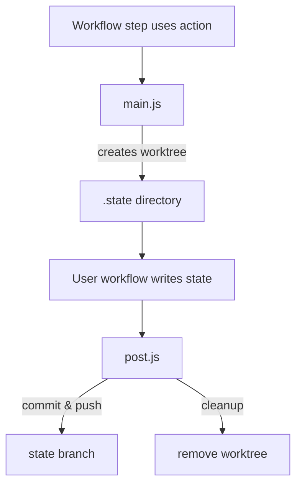

# Repository Overview

Stateful Action is a GitHub Action that stores application state in a dedicated branch using Git worktrees. It checks out a branch like `state` as a worktree, lets workflows write files into that directory, and then commits and squashes history to keep the branch concise.

# Directory and File Structure
```
/ (root)
├── LICENSE
├── Makefile
├── README.md
├── _template.js
├── action.yml
├── main.js
├── post.js
├── pre-commit
├── scripts/
│   ├── main.sh
│   └── post.sh
└── .github/
    └── workflows/
        └── example.yml
```
- **LICENSE** – MIT license for the project.
- **Makefile** – Builds `main.js` and `post.js` from shell script templates and installs a pre-commit hook.
- **README.md** – Documentation and usage instructions.
- **_template.js** – Shared JavaScript wrapper that executes embedded shell scripts.
- **action.yml** – Defines inputs and entry points for the GitHub Action.
- **main.js** – Sets up the state branch as a Git worktree.
- **post.js** – Commits and squashes changes on the state branch and cleans up.
- **pre-commit** – Git hook to regenerate `main.js` and `post.js` when scripts change.
- **scripts/** – Bash scripts used to generate the action’s runtime code.
- **.github/workflows/** – Example workflow demonstrating usage.

# Core Components

## main.js / scripts/main.sh
- **Purpose:** Prepare a worktree for the state branch.
- **Key Steps:**
  - Configure Git author if missing.
  - Verify `.$branch/` appears in `.gitignore`.
  - Fetch or create the state branch and add it as a worktree under `.$branch/`.
- **Interaction:** Executed at the beginning of the action to provide a workspace where user code can store state files.

## post.js / scripts/post.sh
- **Purpose:** Persist state changes and keep history small.
- **Key Steps:**
  - Commit new files within the worktree.
  - Push changes to origin and squash older commits beyond a configurable backup count using an interactive rebase driven by `sed`.
  - Remove the worktree and local branch.
- **Interaction:** Runs after the workflow step completes to save state and clean up.

## _template.js
- **Purpose:** Wraps shell scripts in Node.js, executing them via `child_process.exec` and piping output.
- **Interaction:** Included in `main.js` and `post.js` to provide consistent execution and error handling.

## action.yml
- Defines inputs (`branch`, `backup`, `git_author_name`, `git_author_email`) and ties `main.js` and `post.js` to the GitHub Action lifecycle.

## pre-commit Hook
- Detects staged changes under `scripts/` and rebuilds `main.js` and `post.js` with the Makefile.

# Data Flow or Control Flow



# External Dependencies
- **Node.js 12** – Runtime for the action.
- **Git** – Used for worktree management, commits, and history rewriting.
- **sed** – Applies script edits during interactive rebase when squashing commits.

# Notable Design Decisions
- Uses Git worktrees to isolate state without affecting the main working directory.
- Squashes history after each run to keep the state branch lightweight.
- Generates runtime JavaScript files from shell script templates via the Makefile, ensuring shell logic and Node wrapper stay in sync.

# Limitations or Warnings
- Requires the repository to ignore `.$branch/` in `.gitignore`; otherwise the action aborts.
- No automated tests or build validation are included in the repository.
- Running locally without a configured `origin` remote will cause `main.js` to fail when fetching the state branch.

# Error Handling
- Shell scripts execute with `set -e` to halt on errors.
- Node wrappers exit with the shell’s status code and log `stderr` output, ensuring GitHub Action steps fail on error.

